# 💼 Thị Trường Việc Làm IT Việt Nam - Dashboard Phân Tích

## 📋 Tổng Quan

Dự án phân tích dữ liệu thị trường việc làm IT tại Việt Nam, cung cấp dashboard tương tác để khám phá xu hướng lương, kỹ năng, địa lý và thời gian thông qua dữ liệu thu thập từ các trang tuyển dụng hàng đầu.

### ✨ Tính Năng Chính

- **Dashboard Cơ Bản**: Phân tích tổng quan về phân phối lương, kỹ năng và địa lý
- **Dashboard Nâng Cao**: Phân tích sâu với các biểu đồ tương tác và insights chi tiết
- **Storytelling**: Báo cáo tường thuật về câu chuyện từ dữ liệu
- **Backend**: Hệ thống crawl và xử lý dữ liệu tự động
- **Docker**: Triển khai dễ dàng với container

## 🚀 Cách Chạy Dự Án

### Phương Pháp 1: Sử Dụng Docker (Khuyến Nghị)

```bash
# Clone repository
git clone https://github.com/LeKhanhToan1509/khdl.git
cd khdl

# Chạy toàn bộ hệ thống bằng Docker Compose
docker-compose up -d

# Kiểm tra containers đang chạy
docker ps
```

**Truy cập ứng dụng:**
- MongoDB: `mongodb://localhost:27017`
- Backend API: `http://localhost:5000`
- Dashboard sẽ cần chạy riêng (xem bước tiếp theo)

### Phương Pháp 2: Chạy Thủ Công

#### 1. Cài đặt Dependencies

```bash
# Tạo môi trường ảo Python
python -m venv venv
source venv/bin/activate  # Linux/Mac
# hoặc
venv\Scripts\activate  # Windows

# Cài đặt packages
pip install streamlit pandas plotly pymongo scikit-learn numpy
pip install -r be/requirements.txt
```

#### 2. Khởi động MongoDB

```bash
mongod --port 27017
```

#### 3. Chạy Backend (Tùy chọn)

```bash
cd be/src
python app.py
```

#### 4. Chạy Dashboard

```bash
# Dashboard cơ bản
streamlit run dashboard.py

# Dashboard nâng cao
streamlit run dashboard_advanced.py

# Storytelling page
streamlit run storytelling.py
```

## 🖥️ Giao Diện Dashboard

### 1. Dashboard Cơ Bản (`dashboard.py`)

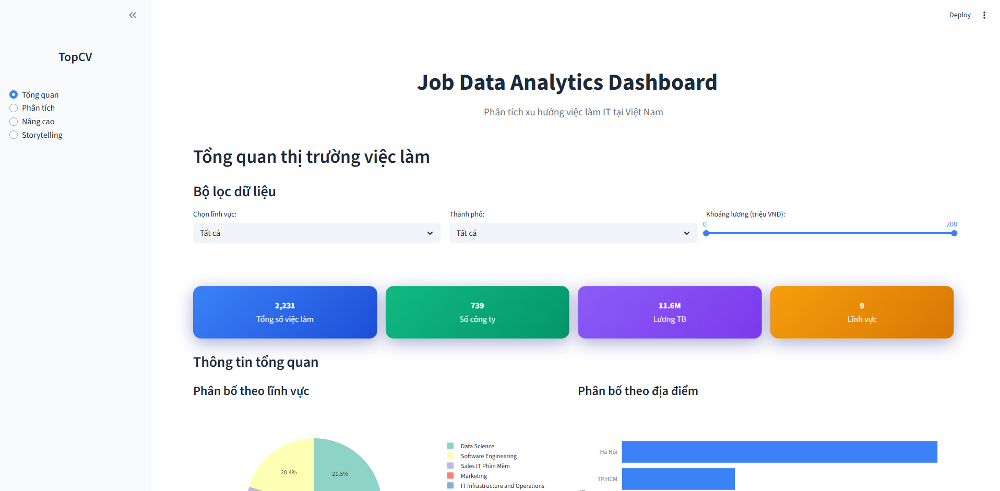
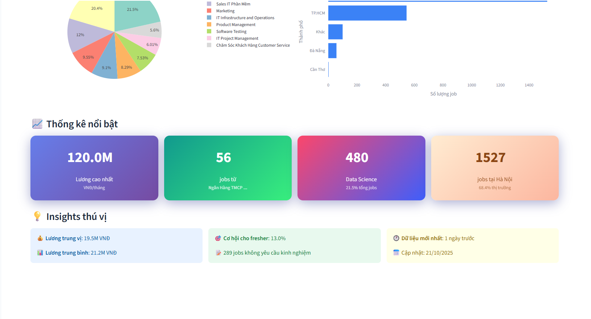

### 2. Dashboard Nâng Cao (`dashboard_advanced.py`)

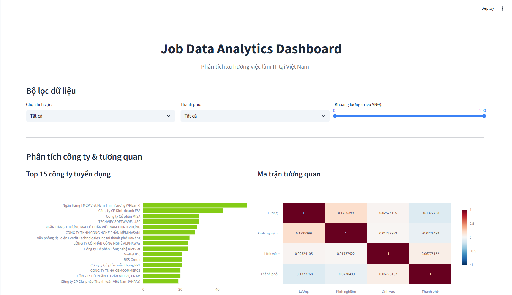
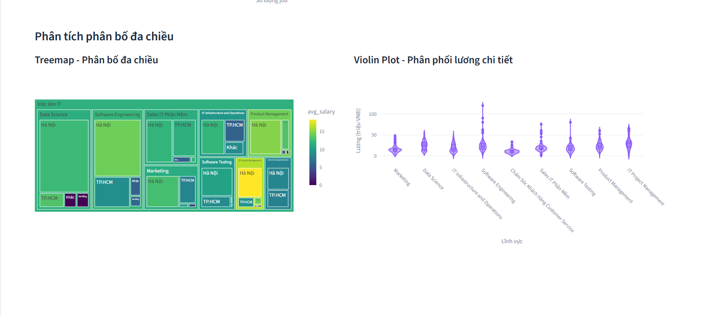

### 3. Data Analyst View

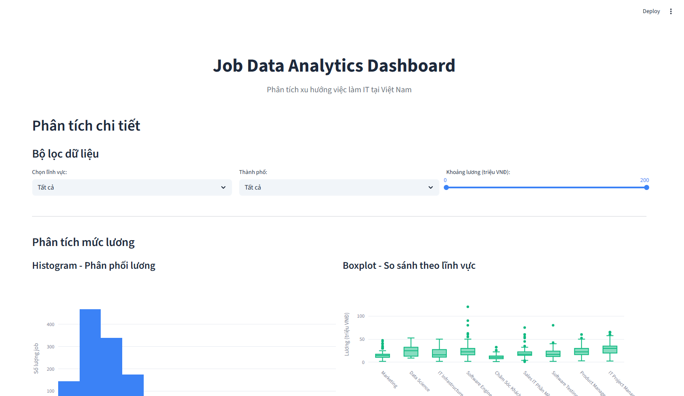
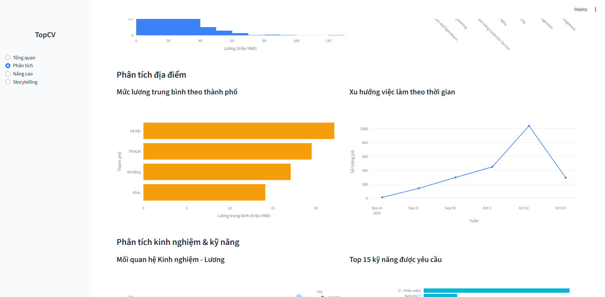


### 4. Storytelling Dashboard (`storytelling.py`)

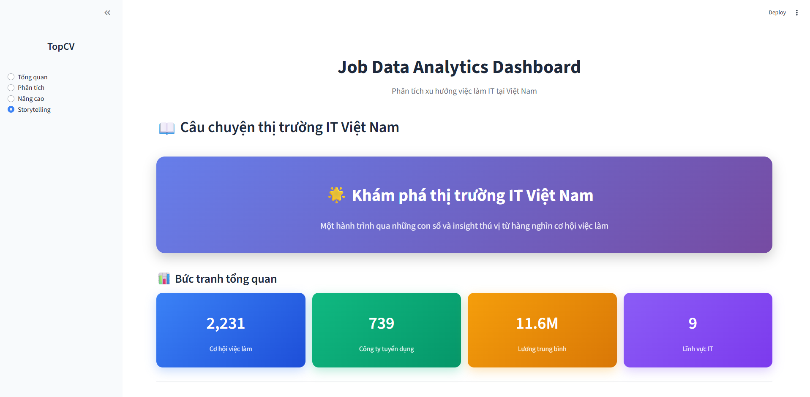
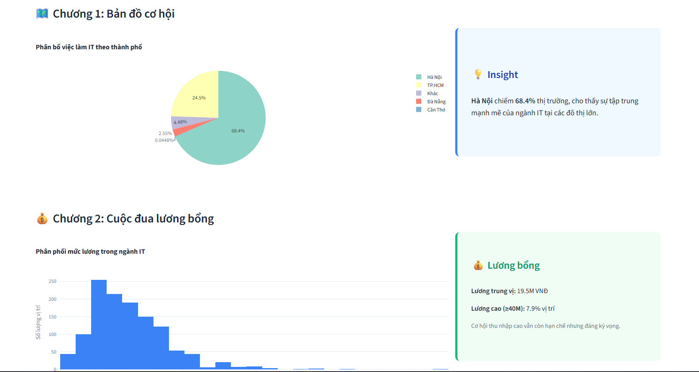
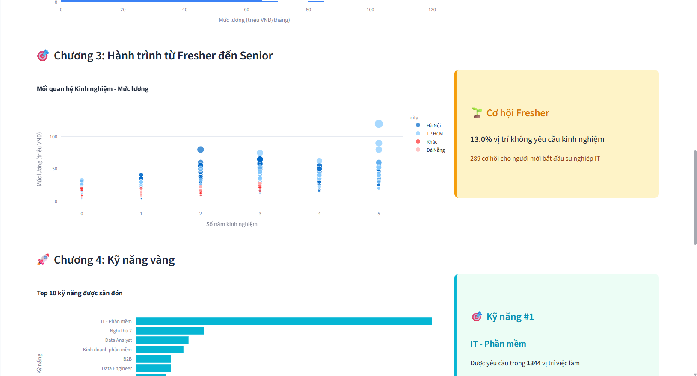
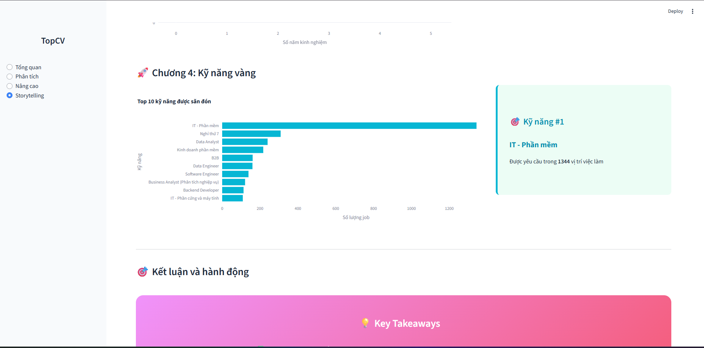
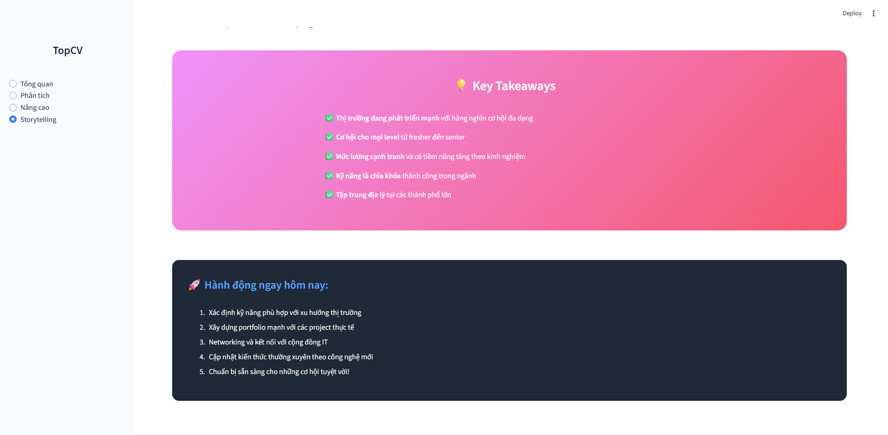

## 📁 Cấu Trúc Dự Án

```
📦 bt/
├── 📁 be/                          # Backend services
│   ├── 📁 src/
│   │   ├── app.py                   # Flask API chính
│   │   ├── crawl.py                 # Web crawler
│   │   ├── normalize_data.py        # Xử lý và chuẩn hóa dữ liệu
│   │   └── scheduler.py             # Tự động hóa crawl
│   ├── Dockerfile                   # Docker image cho backend
│   └── requirements.txt             # Dependencies backend
├── 📁 images/                       # Screenshots dashboard
├── 📁 docs/                         # Tài liệu dự án
├── dashboard.py                     # Dashboard cơ bản
├── dashboard_advanced.py            # Dashboard nâng cao
├── storytelling.py                  # Storytelling dashboard
├── docker-compose.yml               # Docker orchestration
└── README.md                        # File này
```

## 🗄️ Dữ Liệu

### Nguồn Dữ Liệu
- **TopCV**: Jobs công nghệ thông tin
- **VietnamWorks**: Việc làm IT
- **ITviec**: Chuyên ngành IT
- **Các trang tuyển dụng khác**

### Cấu Trúc Dữ Liệu
```json
{
  "title": "Senior Full Stack Developer",
  "company": "Tech Company ABC",
  "salary": "25-35 triệu VNĐ",
  "location": "Hà Nội",
  "experience": "3-5 năm",
  "skills": ["React", "Node.js", "Python"],
  "posted_date": "2024-10-15",
  "job_type": "Full-time",
  "company_size": "100-500 nhân viên"
}
```

## 📊 Các Loại Biểu Đồ Được Hỗ Trợ

- **Histogram**: Phân phối mức lương
- **Box Plot**: So sánh lương theo lĩnh vực
- **Scatter Plot**: Mối quan hệ kinh nghiệm - lương
- **Line Chart**: Xu hướng tuyển dụng theo thời gian
- **Treemap**: Phân bố việc làm theo địa lý
- **Heatmap**: Correlation matrix kỹ năng
- **Word Cloud**: Kỹ năng phổ biến
- **Sunburst**: Phân tích đa chiều


---