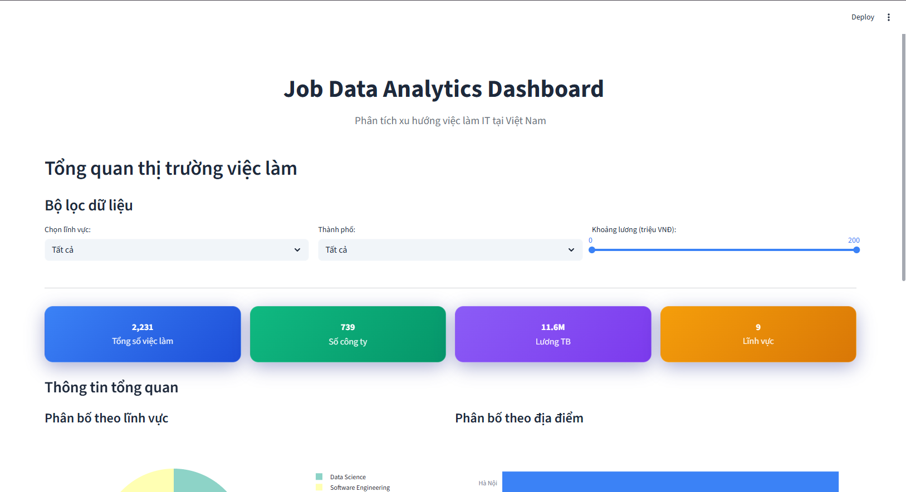
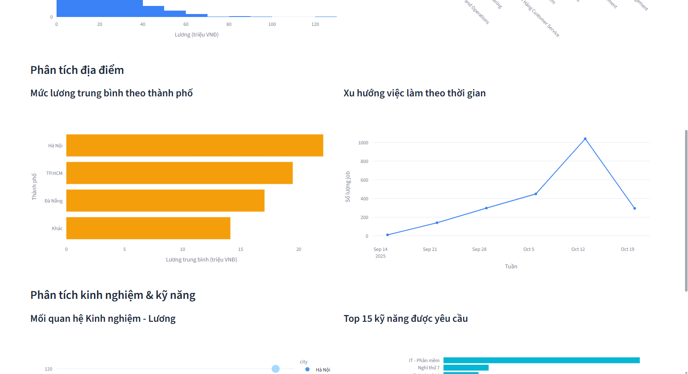
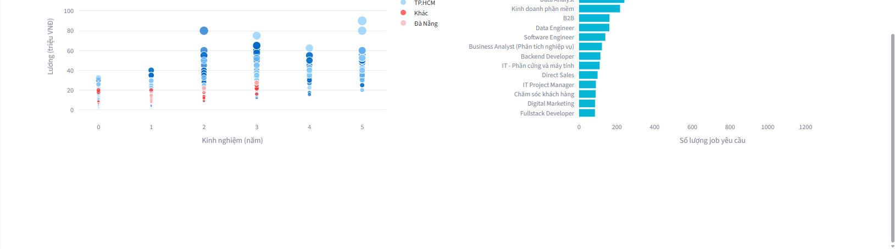
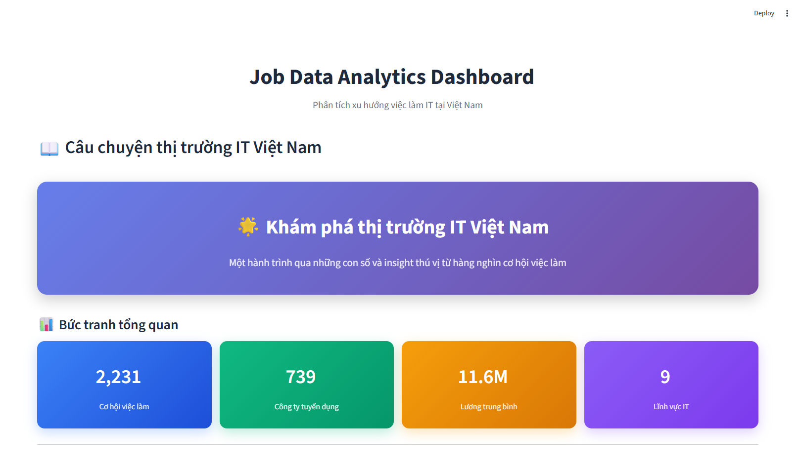
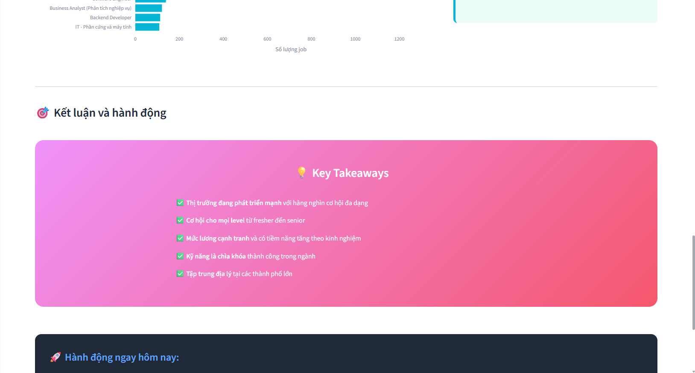
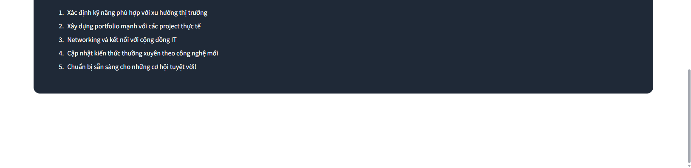

# 💼 Thị Trường Việc Làm IT Việt Nam - Dashboard Phân Tích

## 📋 Tổng Quan

Dự án phân tích dữ liệu thị trường việc làm IT tại Việt Nam, cung cấp dashboard tương tác để khám phá xu hướng lương, kỹ năng, địa lý và thời gian thông qua dữ liệu thu thập từ các trang tuyển dụng hàng đầu.

### ✨ Tính Năng Chính

- 📊 **Dashboard Cơ Bản**: Phân tích tổng quan về phân phối lương, kỹ năng và địa lý
- 🔍 **Dashboard Nâng Cao**: Phân tích sâu với các biểu đồ tương tác và insights chi tiết
- 📖 **Storytelling**: Báo cáo tường thuật về câu chuyện từ dữ liệu
- 🗄️ **Backend**: Hệ thống crawl và xử lý dữ liệu tự động
- 🐳 **Docker**: Triển khai dễ dàng với container

## 🚀 Cách Chạy Dự Án

### Phương Pháp 1: Sử Dụng Docker (Khuyến Nghị)

```bash
# Clone repository
git clone https://github.com/LeKhanhToan1509/khdl.git
cd khdl

# Chạy toàn bộ hệ thống bằng Docker Compose
docker-compose up -d

# Kiểm tra containers đang chạy
docker ps
```

**Truy cập ứng dụng:**
- MongoDB: `mongodb://localhost:27017`
- Backend API: `http://localhost:5000`
- Dashboard sẽ cần chạy riêng (xem bước tiếp theo)

### Phương Pháp 2: Chạy Thủ Công

#### 1. Cài đặt Dependencies

```bash
# Tạo môi trường ảo Python
python -m venv venv
source venv/bin/activate  # Linux/Mac
# hoặc
venv\Scripts\activate  # Windows

# Cài đặt packages
pip install streamlit pandas plotly pymongo scikit-learn numpy
pip install -r be/requirements.txt
```

#### 2. Khởi động MongoDB

```bash
# Cài đặt và chạy MongoDB cục bộ
# Hoặc sử dụng MongoDB Atlas (cloud)
mongod --port 27017
```

#### 3. Chạy Backend (Tùy chọn)

```bash
cd be/src
python app.py
```

#### 4. Chạy Dashboard

```bash
# Dashboard cơ bản
streamlit run dashboard.py

# Dashboard nâng cao
streamlit run dashboard_advanced.py

# Storytelling page
streamlit run storytelling.py
```

## 🖥️ Giao Diện Dashboard

### 1. Dashboard Cơ Bản (`dashboard.py`)



**Tính năng:**
- 📈 Phân tích phân phối mức lương
- 🗺️ Bản đồ việc làm theo địa lý
- ⚡ Kỹ năng công nghệ phổ biến
- 📊 Thống kê cơ bản theo ngành


### 2. Dashboard Nâng Cao (`dashboard_advanced.py`)


**Tính năng nâng cao:**
- 🔍 Bộ lọc tương tác theo nhiều tiêu chí
- 📋 Bảng dữ liệu có thể sắp xếp và tìm kiếm
- 💹 Biểu đồ correlation matrix
- 🎯 Phân tích xu hướng theo thời gian
- 📊 Biểu đồ boxplot và scatter plot


### 3. Data Analyst View


**Phân tích chuyên sâu:**
- 📈 Xu hướng tuyển dụng theo thời gian
- 💰 Phân tích mức lương theo kinh nghiệm
- 🏢 So sánh theo quy mô công ty





### 4. Storytelling Dashboard (`storytelling.py`)



**Câu chuyện từ dữ liệu:**
- 📖 Tường thuật insights quan trọng
- 🎨 Visualizations có thiết kế đẹp mắt
- 💡 Phân tích định tính kết hợp định lượng






## 📁 Cấu Trúc Dự Án

```
📦 bt/
├── 📁 be/                          # Backend services
│   ├── 📁 src/
│   │   ├── app.py                   # Flask API chính
│   │   ├── crawl.py                 # Web crawler
│   │   ├── normalize_data.py        # Xử lý và chuẩn hóa dữ liệu
│   │   └── scheduler.py             # Tự động hóa crawl
│   ├── Dockerfile                   # Docker image cho backend
│   └── requirements.txt             # Dependencies backend
├── 📁 images/                       # Screenshots dashboard
├── 📁 docs/                         # Tài liệu dự án
├── dashboard.py                     # Dashboard cơ bản
├── dashboard_advanced.py            # Dashboard nâng cao
├── storytelling.py                  # Storytelling dashboard
├── docker-compose.yml               # Docker orchestration
└── README.md                        # File này
```

## 🗄️ Dữ Liệu

### Nguồn Dữ Liệu
- **TopCV**: Jobs công nghệ thông tin
- **VietnamWorks**: Việc làm IT
- **ITviec**: Chuyên ngành IT
- **Các trang tuyển dụng khác**

### Cấu Trúc Dữ Liệu
```json
{
  "title": "Senior Full Stack Developer",
  "company": "Tech Company ABC",
  "salary": "25-35 triệu VNĐ",
  "location": "Hà Nội",
  "experience": "3-5 năm",
  "skills": ["React", "Node.js", "Python"],
  "posted_date": "2024-10-15",
  "job_type": "Full-time",
  "company_size": "100-500 nhân viên"
}
```

## 🔧 Cấu Hình

### Biến Môi Trường

Tạo file `.env`:
```env
MONGODB_URI=mongodb://localhost:27017
DATABASE_NAME=job_market
COLLECTION_NAME=jobs
FLASK_ENV=development
```

### Streamlit Configuration

File `.streamlit/config.toml`:
```toml
[theme]
primaryColor = "#1f77b4"
backgroundColor = "#ffffff"
secondaryBackgroundColor = "#f0f2f6"
textColor = "#262730"

[server]
port = 8501
enableCORS = false
```

## 📊 Các Loại Biểu Đồ Được Hỗ Trợ

- **Histogram**: Phân phối mức lương
- **Box Plot**: So sánh lương theo lĩnh vực
- **Scatter Plot**: Mối quan hệ kinh nghiệm - lương
- **Line Chart**: Xu hướng tuyển dụng theo thời gian
- **Treemap**: Phân bố việc làm theo địa lý
- **Heatmap**: Correlation matrix kỹ năng
- **Word Cloud**: Kỹ năng phổ biến
- **Sunburst**: Phân tích đa chiều

## 🛠️ Công Nghệ Sử Dụng

### Frontend
- **Streamlit**: Framework dashboard
- **Plotly**: Thư viện visualization tương tác
- **Pandas**: Xử lý dữ liệu
- **NumPy**: Tính toán khoa học

### Backend
- **Python**: Ngôn ngữ chính
- **Flask**: Web framework
- **MongoDB**: Cơ sở dữ liệu NoSQL
- **PyMongo**: Driver MongoDB
- **Scrapy/BeautifulSoup**: Web crawling
- **Scikit-learn**: Machine learning

### DevOps
- **Docker**: Containerization
- **Docker Compose**: Orchestration
- **Git**: Version control

## 📈 Insights Chính Từ Dữ Liệu

### 💰 Phân Phối Lương
- **Trung bình**: 15-25 triệu VNĐ/tháng
- **Phổ biến nhất**: 12-18 triệu VNĐ (fresh/junior)
- **Cao cấp**: 35-50+ triệu VNĐ (senior/lead)

### 🏢 Theo Lĩnh Vực
1. **AI/ML**: Mức lương cao nhất (28 triệu trung bình)
2. **Blockchain/Fintech**: 26 triệu trung bình
3. **DevOps/Cloud**: 22 triệu trung bình
4. **Web Development**: 15 triệu trung bình

### 📍 Theo Địa Lý
- **Hà Nội**: 32% việc làm, lương cao nhất
- **TP.HCM**: 28% việc làm, đa dạng cơ hội
- **Đà Nẵng**: 12% việc làm, tỷ lệ giá/chất lượng tốt

### ⚡ Kỹ Năng Hot
1. **Kubernetes**: +18 triệu VNĐ premium
2. **Apache Kafka**: +16 triệu VNĐ premium
3. **TensorFlow**: +15 triệu VNĐ premium
4. **React**: +8 triệu VNĐ premium

## 🤝 Đóng Góp

1. Fork repository
2. Tạo feature branch (`git checkout -b feature/amazing-feature`)
3. Commit changes (`git commit -m 'Add some amazing feature'`)
4. Push branch (`git push origin feature/amazing-feature`)
5. Tạo Pull Request

## 📝 License

Dự án này được phân phối dưới MIT License. Xem file `LICENSE` để biết thêm thông tin.

## 👥 Tác Giả

- **Lê Khánh Toàn** - *Developer* - [LeKhanhToan1509](https://github.com/LeKhanhToan1509)

## 📞 Liên Hệ

- GitHub: [@LeKhanhToan1509](https://github.com/LeKhanhToan1509)
- Email: your.email@example.com

## 🙏 Acknowledgments

- Cảm ơn các trang tuyển dụng cung cấp dữ liệu công khai
- Cảm ơn cộng đồng Python và Streamlit
- Cảm ơn PTIT - Học viện Công nghệ Bưu chính Viễn thông

---

⭐ **Hãy star repository này nếu bạn thấy hữu ích!**